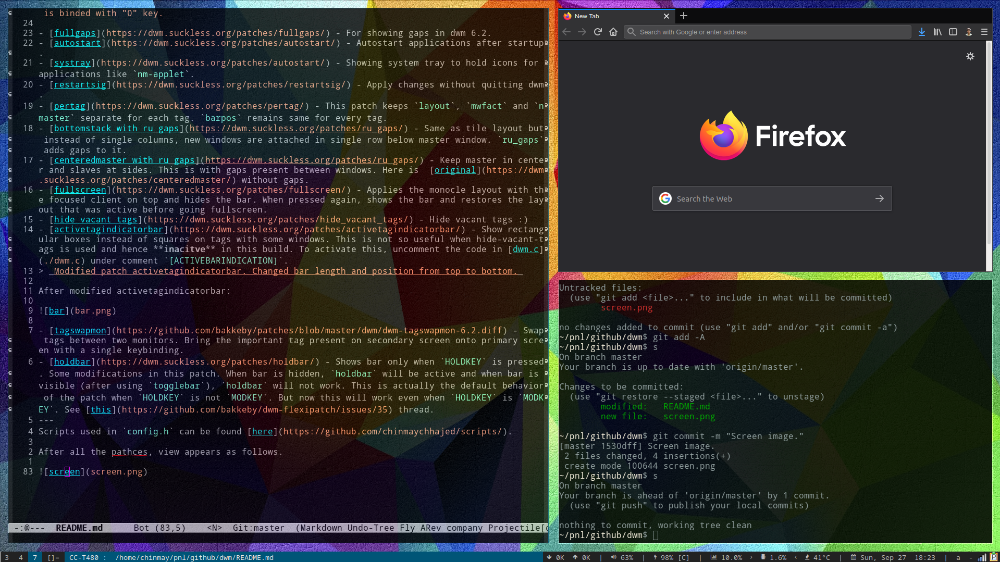

Continued from dwm version 6.2

dwm - dynamic window manager
============================
dwm is an extremely fast, small, and dynamic window manager for X.

Requirements
------------
In order to build dwm you need the Xlib header files.

Installation
------------
Edit config.mk to match your local setup (dwm is installed into
the /usr/local namespace by default).

Afterwards enter the following command to build and install dwm (if
necessary as root):

    make clean install

Running dwm
-----------
Add the following line to your .xinitrc to start dwm using startx:

    exec dwm

In order to connect dwm to a specific display, make sure that
the DISPLAY environment variable is set correctly, e.g.:

    DISPLAY=foo.bar:1 exec dwm

(This will start dwm on display :1 of the host foo.bar.)

In order to display status info in the bar, you can do something
like this in your .xinitrc:

    while xsetroot -name "`date` `uptime | sed 's/.*,//'`"
    do
    	sleep 1
    done &
    exec dwm

Configuration
-------------
The configuration of dwm is done by creating a custom config.h
and (re)compiling the source code.

Patches
-------

> Not a patch but just a highlight, there are 10 tags in this dwn fork rather default 9. 10th tag is binded with "0" key.

- [fullgaps](https://dwm.suckless.org/patches/fullgaps/) - For showing gaps in dwm 6.2.
- [autostart](https://dwm.suckless.org/patches/autostart/) - Autostart applications after startup.
- [systray](https://dwm.suckless.org/patches/autostart/) - Showing system tray to hold icons for applications like `nm-applet`.
- [restartsig](https://dwm.suckless.org/patches/restartsig/) - Apply changes without quitting dwm.
- [pertag](https://dwm.suckless.org/patches/pertag/) - This patch keeps `layout`, `mwfact` and `nmaster` separate for each tag. `barpos` remains same for every tag.
- [bottomstack with ru_gaps](https://dwm.suckless.org/patches/ru_gaps/) - Same as tile layout but instead of single columns, new windows are attached in single row below master window. `ru_gaps` adds gaps to it.
- [centeredmaster with ru_gaps](https://dwm.suckless.org/patches/ru_gaps/) - Keep master in center and slaves at sides. This is with gaps present between windows. Here is  [original](https://dwm.suckless.org/patches/centeredmaster/) without gaps.
- [fullscreen](https://dwm.suckless.org/patches/fullscreen/) - Applies the monocle layout with the focused client on top and hides the bar. When pressed again, shows the bar and restores the layout that was active before going fullscreen.
- [hide vacant tags](https://dwm.suckless.org/patches/hide_vacant_tags/) - Hide vacant tags :)
- [activetagindicatorbar](https://dwm.suckless.org/patches/activetagindicatorbar/) - Show rectangular boxes instead of squares on tags with some windows. This is not so useful when hide-vacant-tags is used and hence **inacitve** in this build. To activate this, uncomment the code in [dwm.c](./dwm.c) under comment `[ACTIVEBARINDICATION]`.
> _Modified patch activetagindicatorbar. Changed bar length and position from top to bottom._

After modified activetagindicatorbar:

- [tagswapmon](https://github.com/bakkeby/patches/blob/master/dwm/dwm-tagswapmon-6.2.diff) - Swap tags between two monitors. Bring the important tag present on secondary screen onto primary screen with a single keybinding.
- [holdbar](https://dwm.suckless.org/patches/holdbar/) - Shows bar only when `HOLDKEY` is pressed. Some modifications in this patch. When bar is hidden, `holdbar` will be active and when bar is visible (after using `togglebar`), `holdbar` will not work. This is actually the default behavior of the patch when `HOLDKEY` is not `MODKEY`. But now this will work even when `HOLDKEY` is `MODKEY`. See [this](https://github.com/bakkeby/dwm-flexipatch/issues/35) thread.
---
Scripts used in `config.h` can be found [here](https://github.com/chinmaychhajed/scripts/).

After all the pathces, view appears as follows.

